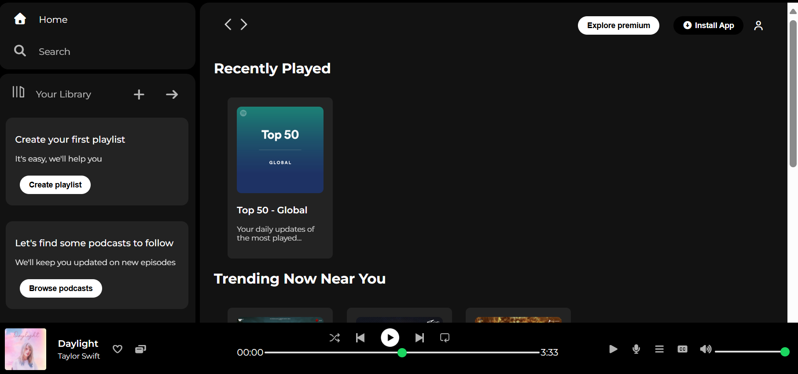
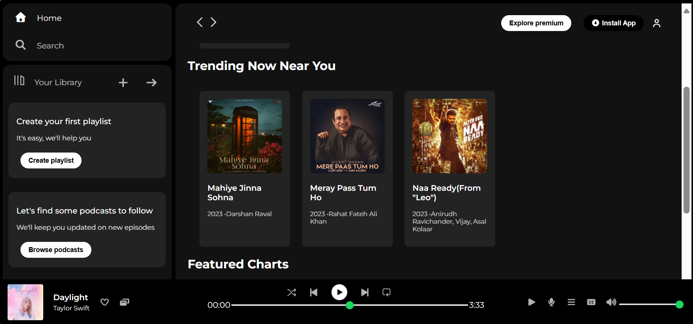
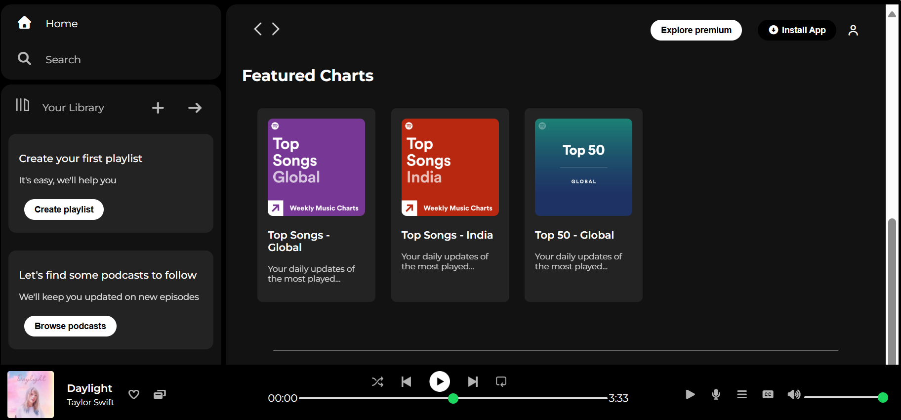

# 🎵 Spotify Clone

A responsive web-based music player UI inspired by Spotify, built with **HTML** and **CSS**.  
This project replicates the look and feel of Spotify's web player for learning and practice purposes.

---

## 📸 Screenshots  

---

## 🚀 Features
- 🎨 Modern, responsive design  
- 📂 Organized project structure with assets folder  
- 📱 Mobile-friendly layout  
- 🎛 Custom music player controls  
- 🎵 Playlist & trending sections  

---

## 🛠️ Technologies Used
- **HTML5**  
- **CSS3**  
- **Font Awesome Icons**  
- **Google Fonts (Montserrat)**  

---

## 📬 Contact
If you have any feedback, suggestions, or questions, feel free to reach out:  

- **GitHub**: [Kanan33](https://github.com/Kanan33) 
- **LinkedIn**: [Kanan Preet Kaur](https://www.linkedin.com/in/kanan-preet-kaur-a46707332/)

## ⚠️ Disclaimer
This project is created solely for educational purposes and is not affiliated with or endorsed by Spotify.  
All rights to Spotify’s brand, logos, and assets belong to their respective owners.
